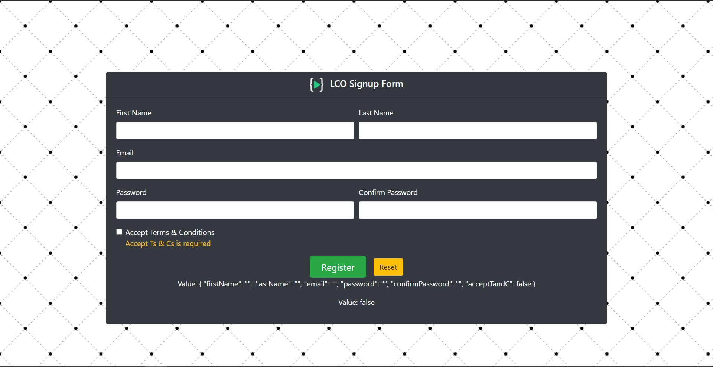
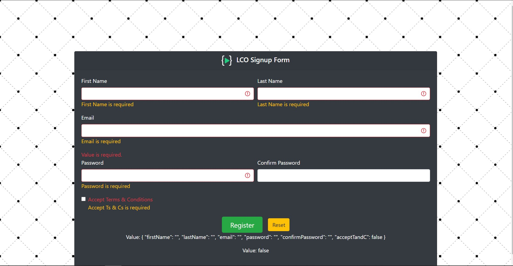

# SignUp Form

## About

This is a Basic SignUp Form Using Angular `Reactive Forms`.

### Topics Learned/Used

- Angular Reactive Forms
- In-built Validators of Angular
- Custom Built Validators
- Displaying Errors Messages with Conditional Rendering.

### Project Images

- SignUp Form
  

- SignUp Form diaplaying Errors Messages

### Project Generated

This project was generated with [Angular CLI](https://github.com/angular/angular-cli) version 11.0.5.

### Development server

Run `ng serve` for a dev server. Navigate to `http://localhost:4200/`. The app will automatically reload if you change any of the source files.

### Note:

- The `value` field shown in the image is for debugging purpose and should not be displayed in production.
- After cloning the project run `npm install` it will install necessary dependencies required to run this project.
- After installing `NodeModules` only, run the `Development Server` command mentioned above.
